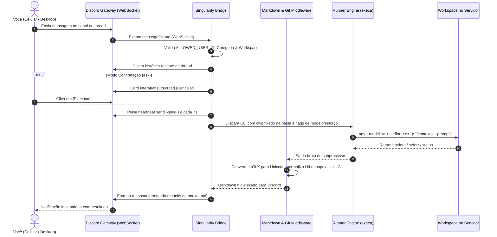

<div align="center">

# 🌌 Singularity
### *Your Workspace. Your AI Agent. In Your Pocket.*

**A headless, ambient Discord bridge transforming everyday chat into a remote CLI command center.**  
Run tasks, iterate with AI coding agents (Google Antigravity), and monitor builds across remote VPS workspaces directly from Discord on desktop and mobile.

<br/>

[](https://nodejs.org/)
[](https://pnpm.io/)
[](https://www.typescriptlang.org/)
[](https://discord.js.org/)
[](https://www.docker.com/)
[](LICENSE)

<br/>

[**📖 Criar o Bot no Discord**](docs/discord-bot-setup.md) • [**🚀 Como Rodar e Fazer Deploy**](docs/how-to-run.md) • [**🛡️ Arquitetura de Segurança**](#-segurança-sem-concessões)

</div>

---

## 💡 O Conceito

Você está na rua, longe do computador, e precisa disparar uma tarefa no servidor, testar uma funcionalidade ou pedir para o seu agente de IA resolver um bug no repositório.

- ❌ **O jeito doloroso:** Abrir um app de terminal SSH no celular, lutar com teclado virtual minúsculo, sessões que caem ao bloquear a tela e zero histórico legível.
- ✅ **Com o Singularity:** Você abre o Discord, entra na thread do seu projeto e conversa normalmente. O Singularity escuta, executa no diretório certo, mantém o feedback de digitação em tempo real e devolve a resposta perfeitamente formatada.

```
┌─────────────────────────────────────────────────────────────────────────────┐
│ 💬 Discord Thread: #project-alpha > [feat-auth]                             │
├─────────────────────────────────────────────────────────────────────────────┤
│ 👤 Luiz:                                                                    │
│    Adicione rota de refresh token com JWT e rode a suíte de testes.         │
│                                                                             │
│ 🤖 Singularity: [digitando...] (heartbeat a cada 7s)                        │  
│                                                                             │
│ 🤖 Singularity:                                                             │
│    ✅ [Singularity] Execution Succeeded (4.8s)                              │
│    • Workspace: /workspace/project-alpha                                    │
│    ```bash                                                                  │
│    PASS src/auth/jwt.service.spec.ts (6 tests passed)                       │
│    Coverage: 94.2% statements                                               │
│    ```                                                                      │
└─────────────────────────────────────────────────────────────────────────────┘
```

---

## ✨ Recursos de Destaque

| Recurso | Como Funciona |
|---|---|
| **Ouvinte Ambiente & Conversa Natural** | Converse de forma fluida sem comandos engessados no chat. Envie instruções diretamente. |
| **Workspaces Híbridos & Auto-Sandbox** | Canais na categoria autorizada ganham auto-sandbox imediato (`./workspaces/<slug>`) com sincronização de renomeação. Mapeie projetos fixos via modal `/singularity map`. |
| **Painel de IA & Stepper de Raciocínio** | `/singularity config` oferece dropdown de modelos (Gemini 3.8 Flash/Pro, Claude Sonnet/Opus) e botões `[ ◀ Menos ]` `[ Mais ▶ ]` com slider idêntico ao TUI oficial do `agy`. |
| **Modos de Permissão Flexíveis** | Escolha entre **🟢 Modo Autônomo** (`--dangerously-skip-permissions` para velocidade total) ou **🛡️ Confirmação Interativa** (cards com botões `[ Executar ]` e `[ Cancelar ]`). |
| **Markdown Rico, LaTeX Unicode & Links** | Respostas naturais sem blocos de código artificiais. Fórmulas KaTeX (`$...$`) vertidas em Unicode (`√n`, `≈ 10¹⁴`), títulos `####` normalizados e links `file://` mapeados para o GitHub. |
| **Memória Contínua em Threads** | Isola o histórico das últimas 8 mensagens dentro da thread aberta, permitindo refinamento iterativo contínuo sem vazamento de contexto. |
| **Typing Heartbeat Real** | Enquanto tarefas rodam, o status *"digitando..."* pulsa a cada 7s, mantendo você informado do progresso. |
| **Chunking Inteligente** | Divide mensagens respeitando cercas de código (` ``` `), com fallback de anexo `.md` / `.txt` se exceder 6.000 caracteres. |
| **Segurança Zero-Trust & Zero Portas** | Apenas seu `ALLOWED_USER_ID` tem acesso. Operação 100% outbound via WebSocket sem portas públicas abertas na VPS. |

---

## 🏗️ Como Funciona por Dentro



---

## ⚡ Começando em 3 Passos

### 1. Clone o repositório e instale dependências
```bash
git clone https://github.com/luizGDpulz/singularity.git
cd singularity
pnpm install
```

### 2. Configure suas credenciais
```bash
cp .env.example .env
```
Edite o arquivo `.env` com seu Token do Bot, seu User ID e os canais mapeados:
```ini
DISCORD_TOKEN=seu_bot_token_aqui
ALLOWED_USER_ID=seu_discord_user_id
ALLOWED_CATEGORY_ID=id_da_sua_categoria_para_auto_sandboxes
WORKSPACE_MAPPINGS={"123456789012345678":"/workspace/projeto-alpha"}
COMMAND_PREFIX_BIN=agy -p
```

### 3. Inicie o daemon

```bash
# Modo desenvolvimento local (com hot-reload):
pnpm dev

# Ou deploy automático com 1 comando na VPS (configura .env e sobe Docker):
chmod +x deploy.sh && ./deploy.sh
```

---

## 📚 Documentação Completa

Para instruções aprofundadas com capturas conceituais, boas práticas e detalhes de produção, consulte nossos guias dedicados:

- 🤖 [**Guia: Como Criar e Configurar o Bot no Discord**](docs/discord-bot-setup.md)  
  *Passo a passo no Discord Developer Portal, permissões, habilitação de Message Content Intent e coleta de IDs.*

- 🚀 [**Guia: Como Rodar Localmente e Deploy com Docker**](docs/how-to-run.md)  
  *Execução com Node 20 / tsx, compilação de produção, montagem de volumes no Docker Compose, dicas de threads e troubleshooting.*

---

## 🛡️ Segurança sem Concessões

- **Barreira de Identidade Rígida:** Qualquer mensagem de terceiros ou outros bots é ignorada e descartada em milissegundos no início do ciclo de vida da requisição.
- **Contenção Estrita de Diretório:** O comando só roda se o canal ou categoria estiver expressamente declarado no mapa `WORKSPACE_MAPPINGS`.
- **Prevenção Total de Injeção de Shell:** Parâmetros e prompts são passados diretamente como matrizes para chamadas nativas do sistema via `execa`, sem interpretação de shell solta (`sh -c`).
- **Resiliência a Falhas (Fail-Fast):** Se alguma configuração estiver incorreta ou malformatada, o sistema avisa o erro exato e interrompe o boot imediatamente, evitando comportamento imprevisível.

---

## 📄 Licença

Distribuído sob a licença [GNU General Public License v3.0](LICENSE).
Feito para trazer liberdade, agilidade e controle aos seus fluxos de desenvolvimento.